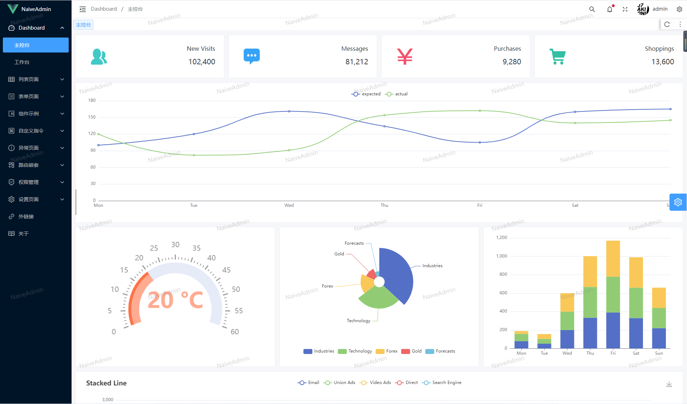
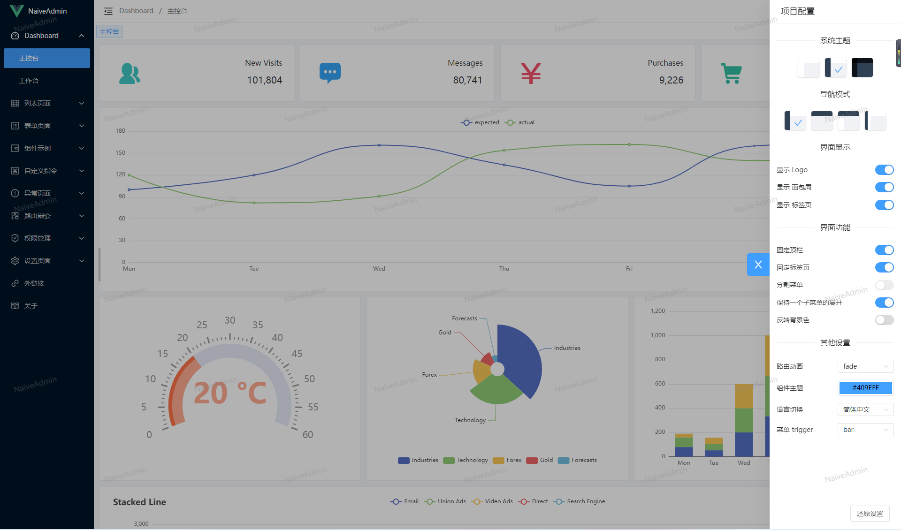
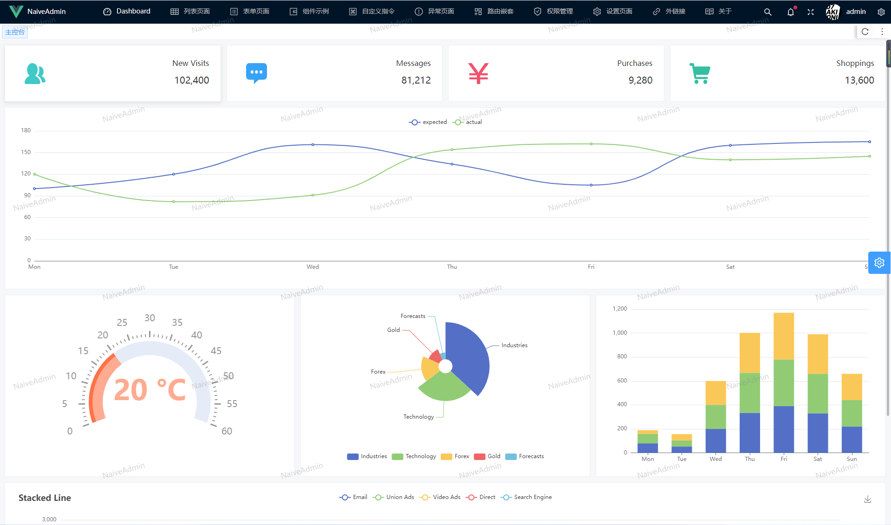
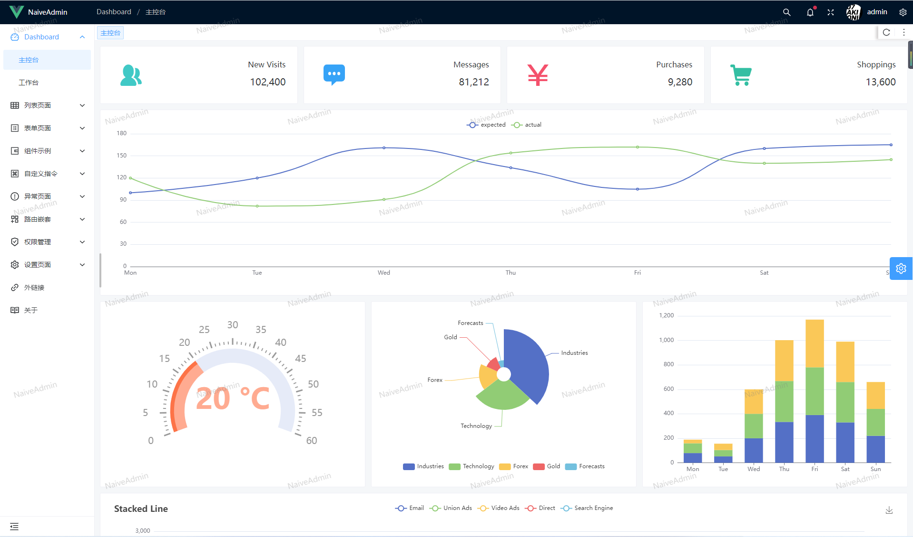
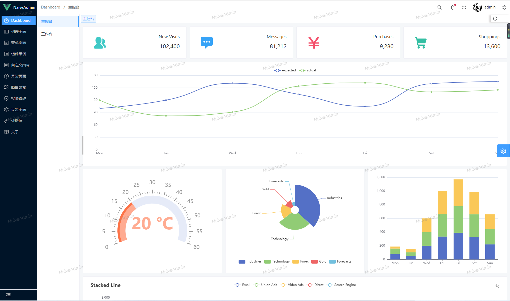

# NaiveAdmin
## Dashboard






## preview
- <a href="https://yx1126.github.io/naive-admin/#/dashboard/console" target="_black">NaiveAdmin (Github)</a>
- <a href="https://yangxin11010.gitee.io/naive-admin/#/dashboard/console" target="_black">NaiveAdmin (Gitee)</a>

## Project Setup
```sh
https://github.com/yx1126/naive-admin.git
```
### or
```sh
https://gitee.com/yangxin11010/naive-admin.git
```
### install
```sh
pnpm install
```

### Compile and Hot-Reload for Development

```sh
pnpm dev
```

### Type-Check, Compile and Minify for Production

```sh
npm build
```

### Lint with [ESLint](https://eslint.org/)

```sh
pnpm lint
```
